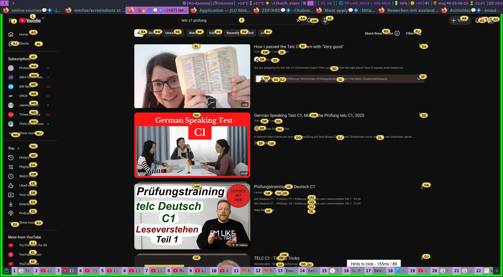

# i3wmfirefox: i3 window manager Firefox Theme 

It is the fork and the customized version of the [cankurttekin's wmfox](https://github.com/cankurttekin/wmfox)

- Hint: Keyboard driven firefox extension: [Surfingkeys extension](https://github.com/brookhong/Surfingkeys)

  => [My personal Surfingkeys.js config file](https://gist.github.com/mirbehroznoor/de0df8ad9870a69d00e998087f66a0f2)

## Screenshots



---

# Installation


### Mozilla firefox directory

* Go to url: `about:support`

* Under heading `Applicaton Basics` look for section `Profile Directory` and click on the `Open Directory`

### Chrome Folder

* Once in directory look for the folder `chrome` if there is no such directory, create one, Manually __OR__ Use Terminal:

```bash
mkdir -p chrome
```

### userChrome.css File

#### 1. First Way

* Go to the directory `chrome/` and create the file `userChrome.css`

* Copy and Paste the contents of `userChrome.css`

#### 2. Second Way

* `git clone https://github.com/mirbehroznoor/i3wmfirefox.git`

* Paste the `userChrome.css` file in `chrome/` folder

### Firefox Permission:

* Go to url `about:config`

* Search for `toolkit.legacyUserProfileCustomizations.stylesheets` set it to __TRUE__

* Restart the Firefox to enjoy your new theme

# Keys

* `Ctrl l` or `F6` slides down the navigation bar with url selection

# Advice

   There are no __one-size-fits-all__ theme

   Have Fun Experimenting

# Previous i3wm firefox theme
- [i3wm-firefox-theme](https://github.com/mirbehroznoor/i3wm-firefox-theme)

---

## Acknowledgments

- [cankurttekin's wmfox](https://github.com/cankurttekin/wmfox)
- [Dook97's firefox-qutebrowser-userchrome](https://github.com/Dook97/firefox-qutebrowser-userchrome)
- [aadilayub's firefox-i3wm-theme](https://github.com/aadilayub/firefox-i3wm-theme)
